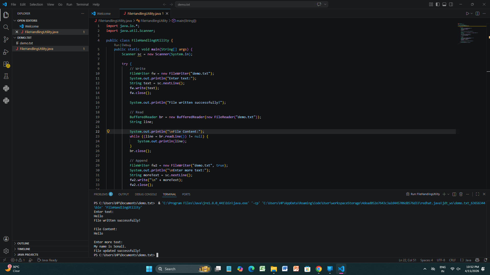

Task 1 - File Handling Utility

Description-
This is a Java program to perform file handling operations.

Features
- Write data into file
- Read file content
- Append data

Output-

Author-
Sonali Waghare
